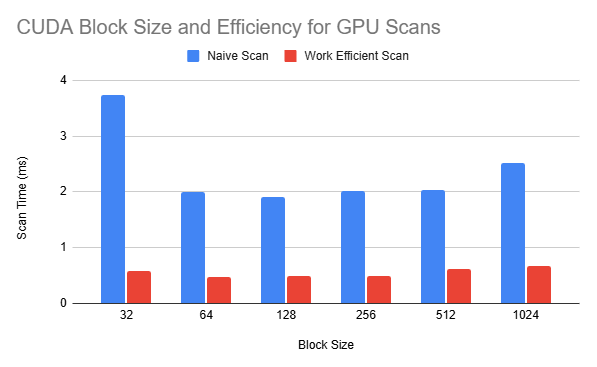
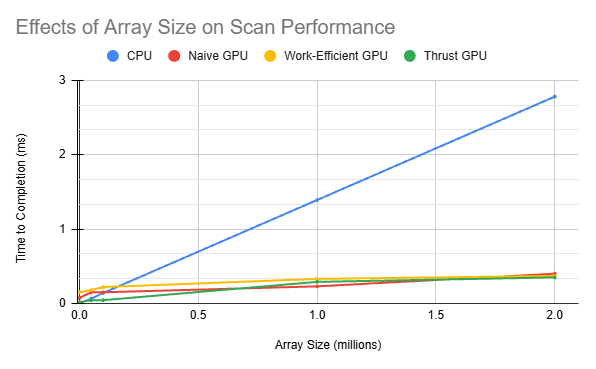
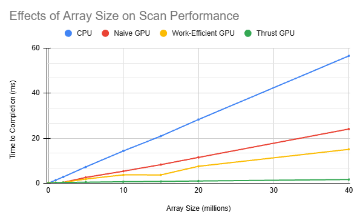
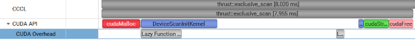

CUDA Stream Compaction
======================

**University of Pennsylvania, CIS 565: GPU Programming and Architecture, Project 2**

* Kevin Du
  * [LinkedIn](https://www.linkedin.com/in/kevinwdu/), [personal website](kevindu.dev)
* Tested on: Windows 11, Intel Core Ultra 5 225F @ 3.30 GHz 32 GB, RTX 5060 (8 GB)

Compile options were added to CMakeLists.txt to fix build errors.

## Implementation Details

In this project, I implement stream compaction and scan/prefix-sum algorithms.

By mapping each input element to a Boolean flag, we can compute an exclusive prefix sum in parallel, giving us the indices of the nonzero elements for stream compaction. We then scatter these elements into their correct positions in the output array.

### Scan Implementations

* CPU scan

* Naive GPU implementation using ping-pong buffers and log_2(n) total passes.

* Work-efficient GPU implementation that modifies the array in place using the Blelloch scan algorithm. It performs up-sweep passes to build partial sums, sets the final root value to zero, and then performs down-sweep passes to produce the exclusive prefix sum. This reduces the total amount of work compared with the naive implementation while using only a single data buffer.

* A wrapper for the Thrust library’s scan implementation

### Stream Compaction Implementations

* CPU (no scan): iterates through the input array and populates the output array with valid elements

* CPU (scan): uses the CPU scan implementation to calculate output positions before scattering the valid elements

* Work-efficient GPU implementation: uses the same stream-compaction algorithm on the GPU, mapping elements to Boolean flags, scanning the flags, and scattering valid elements into the output array


## Evaluating Scan Performance

Before evaluating scan performance, we first determined the optimal CUDA block size for each GPU scan implementation using a large input array.



The benchmark used an array containing 4 million elements, with each block size tested over 10 runs. Reported runtimes for all benchmarks are the median for each configuration. Based on these results, we selected a block size of 128 threads for the naive implementation and 64 threads for the work-efficient Blelloch implementation.

## Performance Comparisons

The following charts and their plots compare CPU, naïve GPU, work-efficient GPU, and Thrust scan
performance as the input array grows. The first plot shows a smaller range of array size values.

| Implementation          | 0.001M | 0.05M |  0.1M |   1M |
| ----------------------- | -----: | ----: | ----: | ---: |
| CPU                     | 0.0014 | 0.064 |  0.14 | 1.39 |
| Naive GPU Scan          |  0.077 |  0.15 |  0.15 | 0.23 |
| Work-Efficient GPU Scan |   0.15 |  0.18 |  0.22 | 0.33 |
| Thrust Scan             |  0.017 | 0.043 | 0.044 | 0.29 |


| Implementation          |   2M |   5M |   10M |   15M |   20M |   40M |
| ----------------------- | ---: | ---: | ----: | ----: | ----: | ----: |
| CPU                     | 2.78 | 7.25 | 14.32 | 20.93 | 28.28 | 56.49 |
| Naive GPU Scan          | 0.40 | 2.58 |  5.35 |  8.26 | 11.47 | 24.06 |
| Work-Efficient GPU Scan | 0.37 | 1.87 |  3.73 |  3.71 |  7.53 | 15.05 |
| Thrust Scan             | 0.35 | 0.47 |  0.69 |  0.82 | 1.008 |  1.67 |





- CPU performance scales roughly linearly with array size because the implementation iterates through the input sequentially. For small arrays, the CPU outperforms the GPU implementations because it avoids kernel launch overhead costs. The GPU implementations surpass the CPU at around 100k elements.
- Up until 2 million elements, the custom GPU implementations have relatively similar performance. At larger sizes, their differences become more visible as the parallel work becomes large enough to overtake fixed overhead costs.
- During the up-sweep and down-sweep phases of the work-efficient GPU scan, each successive level uses half as many active threads, reducing the number of operations compared to the naive ping-pong implementation. However, this version requires more  kernel launches and index calculations, which makes it slower than the naive implementation below roughly 2 million elements.
- Step shapes appear in the data for the work-efficient GPU scan since the array size must be padded to the next power of 2. This makes performance jump as array size crosses each power or 2.
- The thrust implementation performs much better at large sizes.

## Nsight Analysis


<!-- Replace this placeholder with the Nsight screenshot, for example:
& "C:\Program Files\NVIDIA Corporation\Nsight Systems 2026.1.3\target-windows-x64\nsys.exe" profile --trace=cuda,nvtx --cuda-trace-all-apis=true --capture-range=none --gpu-metrics-devices=all --cuda-memory-usage=true --force-overwrite=true -o scan_trace "C:\Users\**********\OneDrive\Documents\Github\CIS5650\Fall2026-Project2-Stream-Compaction\build\bin\Release\cis5650_stream_compaction_test.exe"
-->



The NSight Systems report shows the overhead for each implementation, and is where I got most of my insights. From here, we see the Thrust implementation only launches two kernels, giving it a smaller overhead. It is likely using a more optimized algorithm the Blelloch two pass algorithm, and maybe also uses additional shared memory.

## Output Log

Release build test output for 2^25 sized array

```text
****************
** SCAN TESTS **
****************
    [  19  44  32  44   8  29  29  11  45  44  45  34  27 ...  49   0 ]
==== cpu scan, power-of-two ====
   elapsed time: 48.2981ms    (std::chrono Measured)
    [   0  19  63  95 139 147 176 205 216 261 305 350 384 ... 821910531 821910580 ]
==== cpu scan, non-power-of-two ====
   elapsed time: 47.4553ms    (std::chrono Measured)
    [   0  19  63  95 139 147 176 205 216 261 305 350 384 ... 821910454 821910474 ]
    passed
==== naive scan, power-of-two ====
   elapsed time: 19.8308ms    (CUDA Measured, Median of 10 runs)
    passed
==== naive scan, non-power-of-two ====
   elapsed time: 19.4638ms    (CUDA Measured, Median of 10 runs)
    passed
==== work-efficient scan, power-of-two ====
   elapsed time: 7.54882ms    (CUDA Measured, Median of 10 runs)
    passed
==== work-efficient scan, non-power-of-two ====
   elapsed time: 7.4679ms    (CUDA Measured, Median of 10 runs)
    passed
==== thrust scan, power-of-two ====
   elapsed time: 1.53637ms    (CUDA Measured, Median of 10 runs)
    passed
==== thrust scan, non-power-of-two ====
   elapsed time: 1.52947ms    (CUDA Measured, Median of 10 runs)
    passed

*****************************
** STREAM COMPACTION TESTS **
*****************************
    [   2   0   0   1   3   3   3   2   2   2   1   0   1 ...   0   0 ]
==== cpu compact without scan, power-of-two ====
   elapsed time: 67.4651ms    (std::chrono Measured)
    [   2   1   3   3   3   2   2   2   1   1   1   1   2 ...   1   1 ]
    passed
==== cpu compact without scan, non-power-of-two ====
   elapsed time: 68.452ms    (std::chrono Measured)
    [   2   1   3   3   3   2   2   2   1   1   1   1   2 ...   2   1 ]
    passed
==== cpu compact with scan ====
   elapsed time: 220.688ms    (std::chrono Measured)
    [   2   1   3   3   3   2   2   2   1   1   1   1   2 ...   1   1 ]
    passed
==== work-efficient compact, power-of-two ====
   elapsed time: 39.9206ms    (CUDA Measured)
    passed
==== work-efficient compact, non-power-of-two ====
   elapsed time: 40.3051ms    (CUDA Measured)
    passed
```

